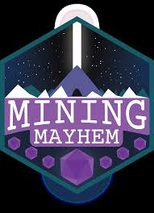

# WKU IEEE Robot 2025
The WKU IEEE Robot is a EE/ME Senior Project. This is a repository for our (robot_ws). 

 

Run these commands to accomplish your task. Make sure that you are in the `robot_ws` when you try to push anything. 

It is necessary to have this remote repository and the local repository to have the same changes, in order to do that the following commands need to be ran.

    git add '$file_you_want_to_add'
    git config pull.rebase false
    git pull origin main
    git push origin main

    echo "# ieee" >> README.md
    git init
    git add README.md
    git commit -m "first commit"
    git branch -M main
    git remote add origin git@github.com:nivene/ieee.git
    git push -u origin main

